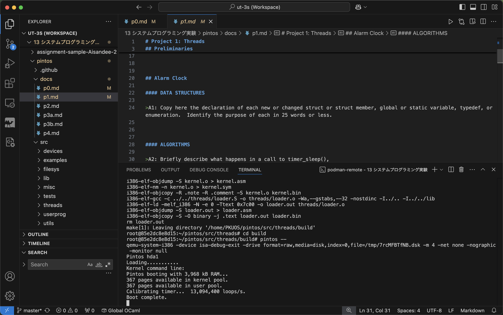
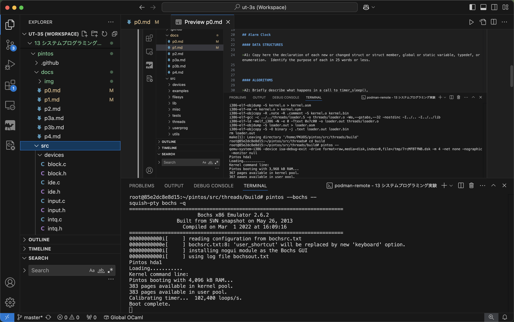
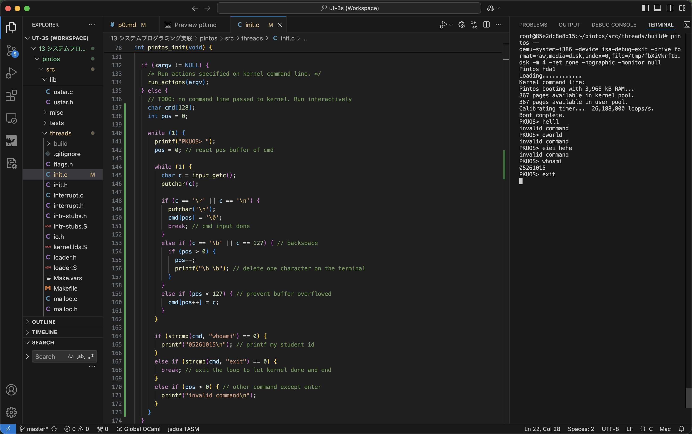

# Project 0: Getting Real

## Preliminaries

>Fill in your name and email address.

Chayanant Sandee <chayanant2005@gmail.com>

>If you have any preliminary comments on your submission, notes for the TAs, please give them here.


>Please cite any offline or online sources you consulted while preparing your submission, other than the Pintos documentation, course text, lecture notes, and course staff.


## Booting Pintos

>A1: Put the screenshot of Pintos running example here.




## Debugging

#### QUESTIONS: BIOS 

>B1: What is the first instruction that gets executed?

Long jump instruction to the start of BIOS \
0xffff0: ljmp   $0x3630,$0xf000e05b

>B2: At which physical address is this instruction located?

0xffff0


#### QUESTIONS: BOOTLOADER

>B3: How does the bootloader read disk sectors? In particular, what BIOS interrupt is used?

The BIOS interrupt used to read disk sectors is `0x13`, in <read_sector> `int $0x13`. By invoking said interrupt, the bootloader can read disk sectors.

>B4: How does the bootloader decides whether it successfully finds the Pintos kernel?

In <read_mbr>, it reads the partition table embedded in Master Boot Record (MBR). And in <check_parition> address `0x7c52`, it checks if that is Pintos kernel or not via `cmpb $0x20, %es:4(%si)`.

>B5: What happens when the bootloader could not find the Pintos kernel?

Following the previous instruction in B4, it runs `jne next_partition`, to check the next partition. If no partition is found as the Pintos kernel, it prints `"\rNot found\r"`, and call the BIOS interrupt `int $0x18$`, in <no_boot_partition> address `0x7c7d`.

>B6: At what point and how exactly does the bootloader transfer control to the Pintos kernel?

At the end of <next_sector> (following <load_kernel>), it indirectly jumps using `ljmp *start` at address `0x7cd3`.


#### QUESTIONS: KERNEL

>B7: At the entry of pintos_init(), what is the value of expression `init_page_dir[pd_no(ptov(0))]` in hexadecimal format?

```
(gdb) b pintos_init
(gdb) c
(gdb) p/x init_page_dir[pd_no(ptov(0))]
=> 0xc000efef:  int3   
=> 0xc000efef:  int3   
$1 = 0x0 
```
The value is `0x0`.


>B8: When `palloc_get_page()` is called for the first time,

>> B8.1 what does the call stack look like?
>>
>> Using `bt` at breakpoint `palloc_get_page`, we get
```
#0  palloc_get_page (flags=(PAL_ASSERT | PAL_ZERO)) at ../../threads/palloc.c:101
#1  0xc00203aa in paging_init () at ../../threads/init.c:164
#2  0xc002031b in pintos_init () at ../../threads/init.c:100
#3  0xc002013d in start () at ../../threads/start.S:180
```

>> B8.2 what is the return value in hexadecimal format?
>>
>> `finish` command runs the rest of function and print what is returned, which is 0xc0101000.

>> B8.3 what is the value of expression `init_page_dir[pd_no(ptov(0))]` in hexadecimal format?
>>
>> `p/x init_page_dir[pd_no(ptov(0))]`: the value = 0x0

>B9: When palloc_get_page() is called for the third time,

>> B9.1 what does the call stack look like?
>>
>> Breakpoint is set with `b palloc_get_page`, so we called `c` twice to get the third time of palloc_get_page(). And call `bt` to get the call stack:
```
#0  palloc_get_page (flags=PAL_ZERO) at ../../threads/palloc.c:101
#1  0xc0020a81 in thread_create (name=0xc002e870 "idle", priority=0, function=0xc0020eb0 <idle>
, aux=0xc000efbc) at ../../threads/thread.c:167
#2  0xc0020976 in thread_start () at ../../threads/thread.c:108
#3  0xc0020334 in pintos_init () at ../../threads/init.c:119
#4  0xc002013d in start () at ../../threads/start.S:180
```

>> B9.2 what is the return value in hexadecimal format?
>>
>> Use `finish` to get the return value = 0xc0103000.

>> B9.3 what is the value of expression `init_page_dir[pd_no(ptov(0))]` in hexadecimal format?
>>
>> Use `p/x init_page_dir[pd_no(ptov(0))]` to get the value = 0x102027.


## Kernel Monitor

>C1: Put the screenshot of your kernel monitor running example here. (It should show how your kernel shell respond to `whoami`, `exit`, and `other input`.)



#### 

>C2: Explain how you read and write to the console for the kernel monitor.

Declare the command buffer `cmd[128]` and buffer position `pos`. \
Read a character typed one by one using `c = getchar()` and reflect that character onto the terminal using `putchar(c)`. \
If the character is `\r` or `\n`, the command input is complete, so we break the reading loop. \
If the character is `\b` or `ASCII 177` (backspace or DEL), we do `printf("\b \b");` to replace the deleted character with whitespace on the terminal, and decrement `pos` by 1 to delete it from the buffer. \
Else, just add the character to the command buffer `cmd[pos++] = c;`. \
After the reading loop is done, we check the command by using `strcmp(cmd, "...")` to determine output for each command.